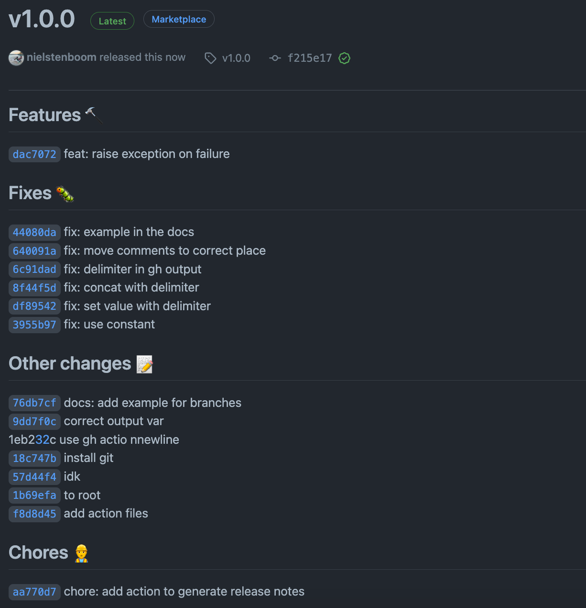

# Semantic changelog generator

This action prints generates a pretty changelog from semantic commits.




## Inputs

## `base`

**Required** The base ref for git log

## `head`

**Required** The head ref for git log

## Outputs

## `changelog`

The generated changelog

## Example usage

```yaml

# make sure to set fetch-depth to 0!
- uses: actions/checkout@v3
  with:
    fetch-depth: 0

- uses: nielstenboom/semantic-changelog-generator@main
  id: changelog
  with:
    base: main
    head: v1.0.0

- name: Get the changelog
  run: |
    cat << "EOF"
    ${{ steps.changelog.outputs.changelog }}
    EOF
```

NOTE: if you want to enter branches with forward slashes in them, you should add 'origin/' in front

```yaml

# make sure to set fetch-depth to 0!
- uses: actions/checkout@v3
  with:
    fetch-depth: 0

# point to branch with forward slashes with 'origin' prepended
- uses: nielstenboom/semantic-changelog-generator@main
  id: changelog
  with:
    base: v1.0.0
    head: origin/my/branch/with/forward/slashes

- name: Get the changelog
  run: |
    cat << "EOF"
    ${{ steps.changelog.outputs.changelog }}
    EOF
```
